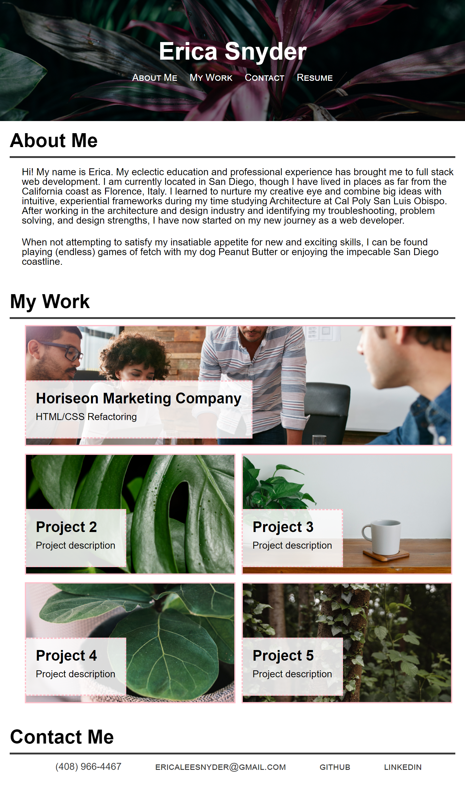

# Professional-Portfolio

## Description
For this project, we were tasked with creating a professional portfolio that included:
- Functioning intra-page links with smooth scroll
- Sections for About Me, My Work, and Contact Me
- Fucntioning links to existing work and placeholder links for future projects
- Responsive layouts based on media widths

## Usage
The portfolio functions the same regardless of whether it is being viewed on a mobile device, a tablet, or a standard web browser, though I included formatting changes for each size. See screenshots below:

Mobile View

Tablet View

Full Browser View

## Features and Challenges
For each of the layouts, I used flex box properties to acurately specify widths and alignments. This was a challenging task as it required edits to the organization of my HTML file in order to function correctly. I utilized pseudoclasses to add more complexity and interest to the page. These pseudoclasses allowed me to animate each of the links in the nav bar, the project links themselves, and each link in the contact me section. 
